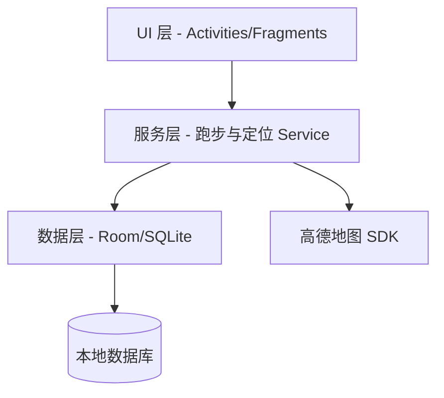

# iRunner - Android 跑步记录应用

## 📌 项目概述
**iRunner** 是一款基于 Android 的跑步记录应用，参考 Keep 跑步设计。  
主要功能包括：开始跑步、实时数据与轨迹绘制、结束后统计数据与成就系统。  
目标是帮助用户高效记录运动过程，激励坚持锻炼。

- **开发工具**：Android Studio 2025.x  
- **语言**：Kotlin / Java  
- **Gradle**：8.x  
- **地图 SDK**：高德地图 Android API  
- **目标系统**：Android 8.0 及以上  

---

## ⚡ 功能介绍

### 跑步流程
- **开始**：点击按钮进入跑步模式。
- **过程**：
  - 实时显示数据（用时、距离、速度、配速）。
  - 使用 GPS 定位，地图上绘制实时轨迹。
- **结束**：
  - 展示统计数据（总距离、总用时、平均配速）。

### 附加功能（暂未实现）
- 历史记录查询（列表 + 详情）。
- 数据导出 / 分享。
- 用户登录与个性化设置（可选）。

---

## 🏗️ 系统架构



## 🛠️ 技术选型

- **语言**：Kotlin / Java
- **UI 框架**：Android Views / Jetpack Compose（可选）
- **数据库**：Room / SQLite （暂未添加数据库）
- **地图与定位**：高德地图 SDK
- **依赖管理**：Gradle
- **版本控制**：Git + GitHub

------

## 🚀 安装与运行

### 开发环境

- JDK 17+
- Android Studio 2025.x
- Android SDK 33+

### 运行步骤

1. 克隆项目

   ```
   git clone https://github.com/hazery0/iRunner.git
   ```

2. 打开 Android Studio → `Open Project`

3. 同步 Gradle 依赖

4. 在 `local.properties` 添加高德地图 API Key：

   ```
   MAPS_API_KEY=64f7b362e2d15e2ba7837281eaca28ca
   ```

5. 运行到真机或模拟器（推荐真机以获取 GPS 数据）。

------

## 📱 使用说明

1. 点击“开始跑步” → 进入跑步模式。
2. 在跑步过程中查看实时数据与轨迹。
3. 点击“结束” → 查看统计数据。

------

## 🔮 未来扩展

- 增加成就系统
- 增加数据库支持登录，记录历史跑步记录
- 支持心率带 / 手表数据接入。
- 云端同步（Firebase / 自建服务器）。
- 增加社交功能（好友排行榜、分享轨迹）。
- 智能训练计划与语音提醒。

------

## 📚 参考资料

- Android 官方文档
- 高德地图 Android SDK
- Room Persistence Library